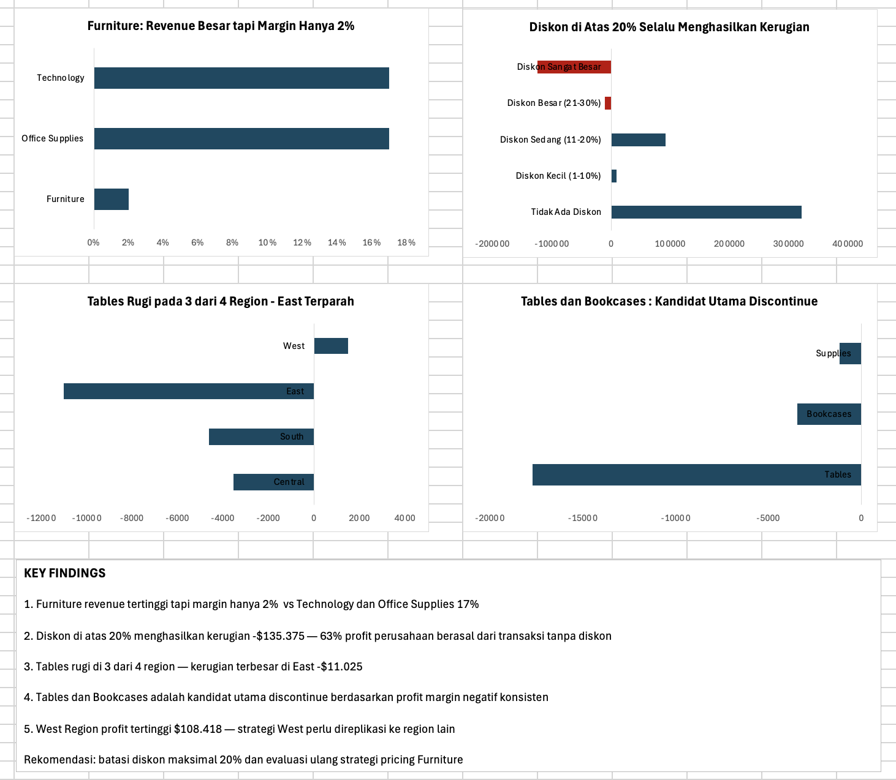

# Superstore Sales Analysis

## Tentang Project
Analisis data penjualan retail Amerika menggunakan Microsoft Excel 
untuk menemukan insight bisnis dan memberikan rekomendasi strategis 
kepada manajemen.

## Dataset
- Sumber: Kaggle — Sample Superstore Dataset
- Jumlah data: 9.994 transaksi
- Periode: 2022–2025
- Tools: Microsoft Excel (PivotTable, Charts, Data Cleaning)

## Pertanyaan Bisnis yang Dijawab
1. Kategori produk mana yang paling menguntungkan?
2. Apakah diskon besar selalu meningkatkan profit?
3. Region mana yang perlu evaluasi strategi?
4. Sub-kategori mana yang harus di-discontinue?
5. Bagaimana hubungan antara diskon dan kerugian?

## Key Findings
1. Furniture menyumbang revenue tertinggi tapi 
   margin hanya 2% vs Technology dan Office Supplies 17%
2. Diskon di atas 20% menghasilkan kerugian total -$135.375 — 
   63% profit berasal dari transaksi tanpa diskon
3. Tables rugi di 3 dari 4 region — 
   kerugian terbesar di East -$11.025
4. Tables dan Bookcases adalah kandidat utama discontinue
5. West Region profit tertinggi $108.418 — 
   strategi West perlu direplikasi ke region lain

## Rekomendasi Bisnis
- Batasi diskon maksimal 20% untuk semua produk
- Evaluasi ulang strategi pricing Furniture
- Pertimbangkan discontinue sub-kategori Tables 
  di region Central, South, dan East
- Replikasi strategi penjualan West Region 
  ke Central yang profitnya paling rendah

## Dashboard Preview

## Struktur File
- superstore-sales-analysis.xlsx : File analisis lengkap
- dashboard-preview.png : Screenshot dashboard
